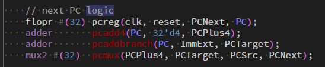

# single-cycle-processor-riscv

```bash
$ iverilog -g2012 adder.sv alu.sv aludec.sv controller.sv datapath.sv dmem.sv extend.sv flopenr.sv flopr.sv imem.sv maindecoder.sv mux2.sv mux3.sv regfile.sv riscvsingle.sv testbench.sv top.sv bcomp.sv
$ vvp a.out
```

## Implemented Instructions
- R-type
  - `add`, `sub`, `and`, `or`, `slt`, `sltu`, `xor`, `srl`, `sra`, `sll`, `jalr`
- I-type
  - `lw`, `addi`, `andi`, `ori`, `xori`, `srli`, `srai`, `slli`, `slti`, `sltiu`,
- B-type
  - `beq`, `bne`, `blt`, `bge`, `bltu`, `bgeu`
- J-type
  - `jal`
- S-type
  - `sw`

## Unimplement Instructions
- I-type
  - `lb`, `lh`, `lbu`, `lhu`
- U-type
  - `auipc`, `lui`
- S-type
  - `sh`, `sb`


## About testbench
`riscvtest.txt` is based on Harris&Harris.
Some instructions are added / modified.

- `sw  x2, 0x20(x3)` has been transformed into `sw  x2, 0x20(x0)` because x3 has an instruction address which would be change by adding testbench lines.
- `ori x4, x4, 8` and `xori x4, x4, 8` are added after `or x4, x7, x2` to test `ori` and `xori`
- `slli x7, x7, 2`, `srli x7, x7, 1`, and `srai x7, x7, 1` are added after `addi x7, x3, -9` to test `slli`, `srli`, and `srai`
- 

## References
1. [Digital Design and Computer Architecture RISC-V Edition](https://www.amazon.co.jp/Digital-Design-Computer-Architecture-RISC-V/dp/0128200642)
2. [RISC-V CONVERTER](https://www.eg.bucknell.edu/~csci206/riscv-converter/index.html#)
3. [計算機構成 第6回 RV32Iのマイクロアーキテクチャ](https://www.am.ics.keio.ac.jp/parthenon/rvmicro.pdf)
4. [Verilog-HDLで算術右シフトを書く方法](https://hikalium.hatenablog.jp/entry/2017/07/10/091146)
5. [SystemVerilog: ビット長拡張（符号拡張）の書き方](https://nodamushi.hatenablog.com/entry/2018/12/03/233840)
   - `bcomp.sv`作成時に参考にした
6. [Amano Lab.](https://www.am.ics.keio.ac.jp/parthenon/)
7. [コンピュータ構成と設計 / Computer Organization and Design](https://yamin.cis.k.hosei.ac.jp/lectures/cod/)

## 疑問点


これはpcregとpcmuxが32単位時間だけ遅れるのか、それともpcreg, pcadd4, pcaddbranchが32単位時間遅れて、pcmuxが32+32=64単位時間遅れるのか

->パラメータを渡しているだけでした。

- ネット上に転がってるRISC-VのVerilog実装だとレジスタ位置のパターン統一が生かされていないものが多い気がする
- 分岐命令はどのように実装するのが良いのか
  - 飛び先計算をALU、大小比較を別の回路というのが1つのパターン[2] (p.14)

- aludec.svは不要？
  - funct3をそのままALUの制御信号にできそう
  - Harris&HarrisではALUControlという信号名で置き換えているがfunct3のままの方が分岐命令のときもわかりやすい

- jalrで&(~1)をとって最下位bitを0にするべきか？

## メモ
### 7/26

```txt
00500113
00C00193
FF718393
0471AA23
06002103
005104B3
008001EF
00100113
00910133
0221A023
00210063
```
でテストを実行すると4行目で[96] = 3の代入をするはずだが[96]=21となっているaddiで負の数が正の数になっている？
addiのときもfunct7b5をarithに代入してしまっていそう
-> arith = funct7b5 & ~ALUSrc (ALUSrcはI命令のとき0, R命令のとき1)としたら上のテストでは[96] = 3となった

```txt
00500113  // addi x2, x0, 5
00C00193  // addi x3, x0, 12
FF718393  // addi x7, x3, -9
402383B3  // sub x7, x7, x2
0471AA23  // sw x7, 84(x3)
06002103
005104B3
008001EF
00100113
00910133
0221A023
00210063
```
でテストしたらx7の値が変になり(x7=-2となるべき)、subの行を消すと正しくx7=3が[96]にswされるのでsubが動いていなさそう

subの問題は解決したように見える（4294967294=-2だったので）が、Harris&Harrisのテストを実行すると
```bash
DataAdr:         96
WriteData: 4294967292
```
となる。

```txt
00500113  // addi x2, x0, 5  # x2 = 5
00C00193  // addi x3, x0, 12 # x3 = 12
8C01A323  // sw x3 70(x0)
FF718393  // addi x7, x3, -9 # x7 = 12-9 = 3
402383B3  // sub x7, x7, x2  # x7 = 3-5 = -2
0023A233  // slt x4, x7, x2  # x4 = (-2 < 5) = 1
00100213  // addi x4, x0, 1  # x4 = 1
00000293  // addi x5, x0, 3  # x5 = 3
005203B3  // add x7, x4, x5  # x7 = 1+3 = 4
A831AA23  // sw x3, 84(x3)   # [96] = 12
A8322A23  // sw x4, 84(x3)   # [96] = 1
0471AA23  // sw x7, 84(x3)   # [96] = 4
06002103
005104B3
008001EF
00100113
00910133
0221A023
00210063
```
Converterを使ってテストの行を足したが信用していいのかわからない。

### 7/25
- 訳が分からなくなったのでALUの制御信号を4bitsにした
- jal, ori, xori, slli, srai, srliがうまく動いていなさそうだったがaddcomを消したらjal以外は動くようになったっぽい
- jalもJump信号をPCSrcまで届けるように直したら動いた
